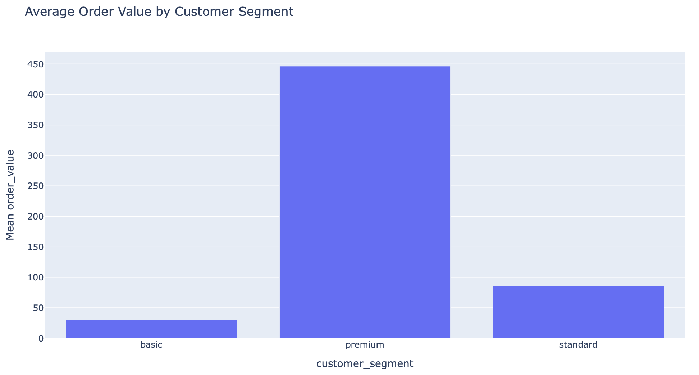
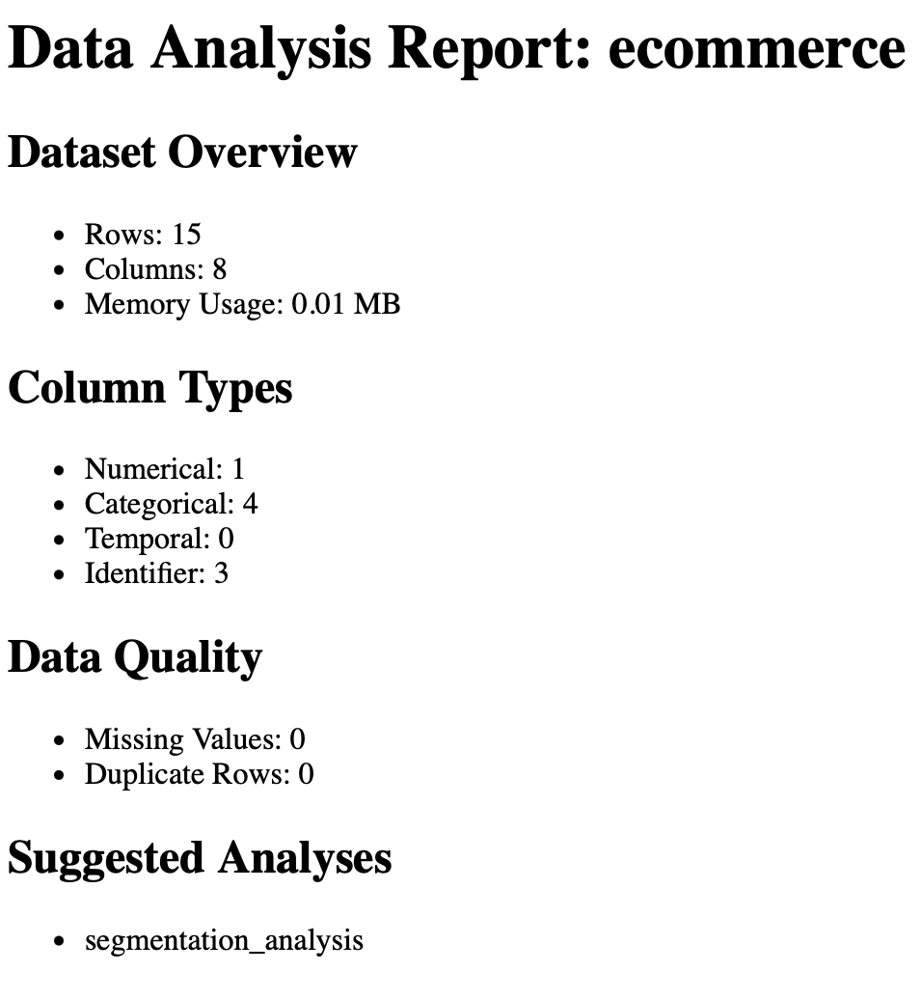

# Analytics Agent CLI

An analytics agent that understands plain English, analyzes your real data locally, and integrates directly into your existing workflow.

**Not another analytics tool** – Skip SQL and custom syntax; just ask questions naturally.  
**Not another chatbot** – Actually performs real analytics operations on your data.  
**Not another web app** – Works directly with your local files and folders.

**Before:** Export data → Upload to ChatGPT → Manually implement suggested analysis → Visualize results yourself  
**After:** Run in your local folder: `> What drives order value? Show me a chart.`

## Why This Matters

Traditional analytics tools force translation from business questions into code. Generic LLM chatbots discuss data without truly analyzing it.

Analytics Agent CLI introduces a new paradigm: **real-world analytics operations through natural conversation**.

### Imagine a future where:

* **Product managers** explore data without learning SQL.
* **Analysts** validate logic interactively before building pipelines.
* **Engineers** receive clear, pre-validated analytics requirements.

This working prototype demonstrates that future today.

## Local Integration Advantages

* **Direct File Access** – No data copying between tools.
* **Real Workflow Integration** – Results saved directly in your project folders.
* **Controlled Data Exposure** – You precisely select data for analysis.
* **Developer-Friendly** – Fully terminal-based, integrates seamlessly into existing workflows.

## Example Usage

```bash
$ cd sample_data
$ aacli "load ecommerce_orders.json as 'sales' then create a bar chart showing average order value by customer_segment"

-> I have loaded the data and created a bar chart showing the average order value by customer segment. 
   Chart saved: outputs/charts/chart_sales_bar_customer_segment.html

$ aacli "analyze the sales data and export insights report"

-> Insights report exported to: outputs/reports/insights_sales.html
```

**Generated Chart:**


**Generated Report:**


*Real outputs generated in seconds - interactive charts and comprehensive analysis reports*

## Quick Start

```bash
# Install
git clone https://github.com/FT1006/analytic-agent-cli.git
cd analytic-agent-cli
pip install -e .

# Setup API Key (Free from Google AI Studio)
export GEMINI_API_KEY=your_key_here

# Try it
cd examples/ecommerce_analytics
aacli
```

## 🏗️ Project Architecture

```
analytic-agent-cli/
├── staffer/                    # Core agent engine
│   ├── functions/             # Function implementations
│   │   ├── analytics/         # 36 analytics functions (tools/resources/prompts)
│   │   ├── excel/            # 16 Excel automation functions  
│   │   └── file_ops/         # 5 file system operations
│   ├── function_registries/   # Dynamic function discovery & registration
│   ├── cli/                  # Command line interface
│   └── available_functions.py # LLM integration & monitoring layer
└── sample_data/              # Example datasets for testing
```

**[→ Read the detailed Technical Architecture](docs/ARCHITECTURE.md)**

## How It Fits Your Workflow

* **Explore quickly** – Validate analytical ideas in minutes.
* **Stakeholder alignment** – Discuss clear analytics insights in plain English.
* **Rapid deployment** – Confidently implement validated logic in production tools (Airflow, dbt, Alteryx).

## Common Commands

**Data Quality Checks:**

* `> check data quality issues`
* `> summarize distribution of order values`
* `> identify outliers`

**Analytical Queries:**

* `> correlate features with sales`
* `> segment customers by behavior`
* `> compare month-over-month performance`

**Visualization & Reporting:**

* `> generate a trend chart`
* `> export insights as HTML`
* `> provide statistical summary`

## Requirements

* Python 3.10+
* Google Gemini API key (free tier available)
* Optional enhancements: pandas, openpyxl

**Note**: Currently supports Google Gemini API only.

## 🚀 Future Updates

- **Subagent capability** - Parallel execution; specialised agents spawning
- **MCP server support** - Integration with Model Context Protocol ecosystem
- **Database connectivity** - Direct BigQuery, Snowflake, and PostgreSQL support

## Project History

Analytics Agent CLI evolved from [Staffer](https://github.com/FT1006/staffer), a personal project exploring AI-powered workflow automation. This version focuses specifically on analytics capabilities and local file integration, representing a specialized branch of the original concept.
